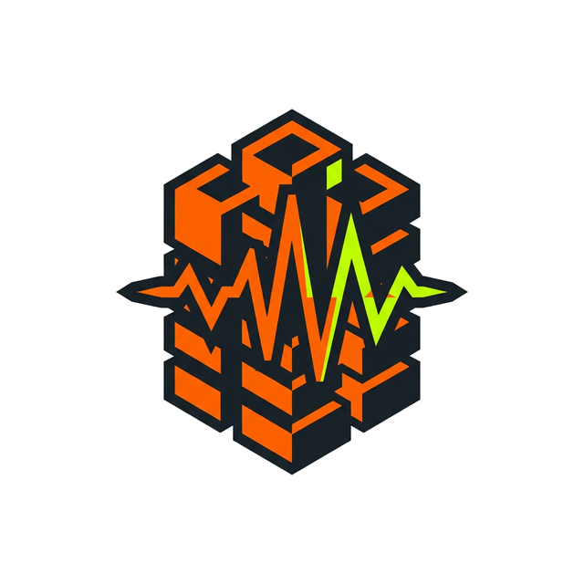

# BTO-Sensei

<div align="center">
  
</div>

BTO-Sensei is an AI-powered HDB (Housing & Development Board) inspection assistant. Built with React, TypeScript, and Vite, it uses the Gemini Live API alongside custom audio DSP to perform real-time acoustic analysis of floor tiles, capture visible construction defects via camera, and auto-generate structural integrity reports.

## Features

- **Acoustic Scan**: Canvas-based FFT spectrogram visualizing tap frequencies in real-time. "Ah Seng" (AI safety officer persona) provides Singlish commentary based on DSP classification (hollow vs. solid tiles).
- **Defect Logger**: Camera viewfinder for capturing defect photos. Defects are logged into a scrollable list with severity badges, review flags, measurement readouts, and verification indicators.
- **Vision Measurement**: Viewfinder measurement toggle indicating a dashed coin-placement guide for Gemini dimension estimation against a standard SG 50-cent coin (24.66mm).
- **Two-Stage Vision Pipeline**: Fast defect classification runs on a documented `generateContent` fallback chain (`gemini-2.5-flash` then `gemini-2.5-flash-lite` by default), while selective second-pass verification and code-execution measurement run on `gemini-3-flash-preview`.
- **Agentic Vision Verification**: The second-pass vision agent uses Gemini code execution to inspect ambiguous images, verify severity decisions, refine bounding boxes, and estimate dimensions from a coin reference when measurement mode is enabled.
- **Report Dashboard**: Professional cover page displaying case metadata, AI-generated executive summaries, health score gauges, and room-by-room breakdowns.
- **HDB Floor Plan Integration**: Dynamic SVG floor plan layouts corresponding to selectable real HDB flat types (3-room, 4-room, 5-room) for accurate spatial mapping.
- **Nano Banana Blueprint**: Interactive blueprint component with toggleable, color-coded callout boxes and leader lines mapping defect markers.

## Architecture


Fully client-side. Two-agent parallel execution (Frontend + Backend) with strict file ownership to prevent merge conflicts.

- **Backend (Logic Layer)**: DSP (`dsp.ts`), Zustand store (`store.ts`), Gemini wiring, tool call handlers, shared type contract (`types.ts`). Wrapper: `BtoApp.tsx`.
- **Frontend (UI Layer)**: React components (lazy-loaded), CSS variables, Framer Motion animations. Entry: `App.tsx` wrapping `BtoApp`.

State is managed via Zustand. Only serializable primitives (current room, audio mode, defect array) persist to `sessionStorage`. Blobs and `Float32Array` are ephemeral.

## Tech Stack

- **Framework**: React 18, TypeScript, Vite
- **State**: Zustand (sessionStorage persistence)
- **AI**: Gemini Live API (native-audio fallback chain by default), Gemini Vision (`gemini-2.5-flash` / `gemini-2.5-flash-lite` fast pass + `gemini-3-flash-preview` agentic pass), function calling, structured output
- **DSP**: Custom FFT + cosine similarity for tap classification
- **UI**: Framer Motion, CSS variables, React Suspense for lazy loading

## Design & UI Generation

The UI was constructed using **Stitch MCP** and **Antigravity**. Stitch MCP provided a pipeline to high-fidelity design assets -- layout configurations, structural models, and a dark industrial "construction" design system. Antigravity consumed these visual directives and translated them into production code.

## Future Plans

- **Live Video Overlays**: Implement real-time AR bounding boxes and structural edge detection overlaid directly on the live camera viewfinder via Canvas/WebRTC to dynamically highlight and track likely defects as the user scans the room.

## Getting Started

1. Clone the repository.
2. `npm install`
3. Copy `.env.example` to `.env` and add your Gemini API key:
   ```
   VITE_GEMINI_API_KEY=your_key_here
   ```
   Optional model overrides:
   ```
   VITE_GEMINI_FAST_VISION_MODEL=gemini-2.5-flash
   VITE_GEMINI_FAST_VISION_MODELS=gemini-2.5-flash,gemini-2.5-flash-lite
   VITE_GEMINI_AGENTIC_VISION_MODEL=gemini-3-flash-preview
   VITE_GEMINI_LIVE_MODEL=gemini-2.5-flash-native-audio-preview-12-2025
   VITE_GEMINI_LIVE_MODELS=gemini-2.5-flash-native-audio-preview-12-2025,gemini-2.5-flash-native-audio-preview-09-2025
   VITE_GEMINI_REPORT_MODEL=gemini-2.5-flash
   ```
4. `npm run dev`
5. Open `http://localhost:5173`.

## Deployment

1. `npm run build` must pass.
2. Deploy to Vercel.
3. Set `VITE_GEMINI_API_KEY`, `VITE_GEMINI_LIVE_MODEL`, `VITE_GEMINI_LIVE_MODELS`, and `VITE_GEMINI_VOICE_NAME` in Vercel Environment Variables.

## Vision Flow

- Normal `Analyze Evidence` uses a fast-pass Gemini vision call with a model fallback chain. By default it tries `gemini-2.5-flash` first, then `gemini-2.5-flash-lite`.
- `Measure & Analyze` uses the same fast pass first, then may run a second-pass agentic verification on `gemini-3-flash-preview`.
- The agentic pass uses Gemini code execution with minimal thinking for deterministic verification and coin-referenced measurement.
- The agentic pass is used to verify ambiguous defects, cross-check severity, tighten bbox localization, and return structured measurement output when the first pass is not sufficient on its own.
- Measure mode can be enabled before or after capture; the current analyze action uses the toggle state shown on screen at click time.
- Fast vision fallbacks all use the same JSON-output `generateContent` shape. If you want to try a newer lite model such as `gemini-3.1-flash-lite-preview`, add it explicitly to `VITE_GEMINI_FAST_VISION_MODELS` after validating availability in your account.

## Live Model Fallbacks

- Live voice sessions default to a native-audio chain: `gemini-2.5-flash-native-audio-preview-12-2025`, then `gemini-2.5-flash-native-audio-preview-09-2025`.
- Native-audio models are connected with `responseModalities: [AUDIO]`, `outputAudioTranscription`, `speechConfig`, and function tools.
- If you explicitly configure a non-native live model in `VITE_GEMINI_LIVE_MODELS`, the app downgrades that candidate to `responseModalities: [TEXT]` instead of incorrectly forcing audio parameters onto it.
- `flash-lite` is not used as an automatic Live fallback because Google does not document it as a Live API audio model.

## Debug Logging

Vision runs emit console logs in DevTools:

- `[camera:analyze]`
- `[vision:fast-pass-start]`
- `[vision:fast-pass-success]`
- `[vision:model-fallback]`
- `[vision:agentic-pass-start]`
- `[vision:agentic-pass-success]`
- `[vision:fast-pass] failure`
- `[vision:agentic-pass] failure`
- `[vision:vision-fallback] failure`
- `[live:connect-start]`
- `[live:connect-success]`
- `[live:model-fallback]`
- `[live:connect] failure`

These logs include room, model, mode, timing, and normalized Gemini error details so API failures can be diagnosed without guessing.

## Graceful Degradation

Gemini calls are wrapped with fallback behavior, but the timeout budget now differs by workflow:

- standard vision: longer fast-pass timeout for image analysis
- measure mode: longer timeout for measurement-heavy calls
- report generation: separate timeout and retry budget from vision

If Gemini is unreachable or too slow, fallback defects/reports are still logged and marked for manual review instead of leaving the UI stuck.
