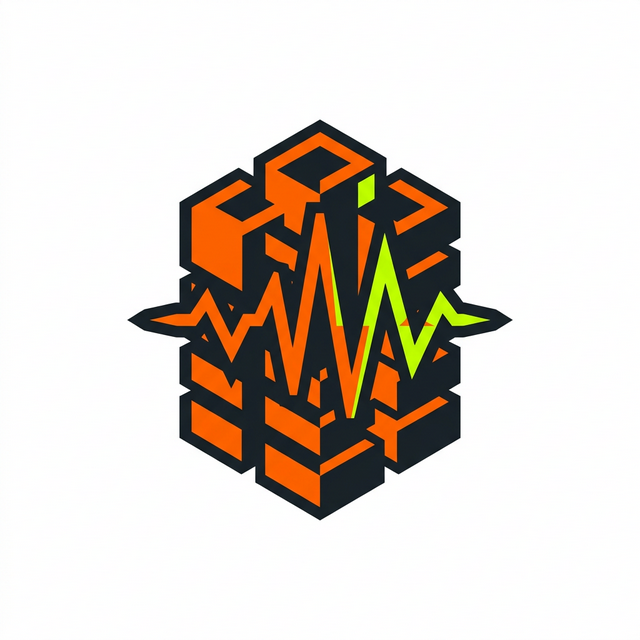
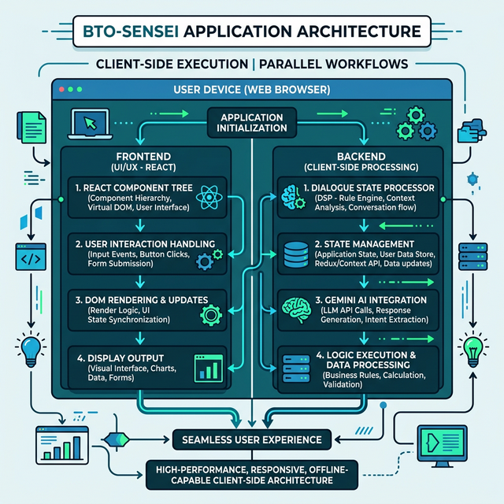

# BTO-Sensei V2.1: Heartlands Edition

<div align="center">
  
</div>



BTO-Sensei is an AI-powered HDB (Housing & Development Board) inspection assistant. Built with React and TypeScript, it utilizes the Gemini Live API alongside custom audio classification via Digital Signal Processing (DSP) to perform real-time acoustic analysis of floor tiles, capture visible construction defects via a camera interface, and auto-generate structural integrity reports.

## Features

- **Acoustic Hero (Scan)**: A canvas-based FFT spectrogram that visualizes tap frequencies in real-time, accompanied by "Ah Seng" (an AI safety officer) providing commentary based on DSP classification (e.g., hollow vs. solid tiles).
- **Defect Logger**: A viewfinder interface allowing you to capture photos of defects, annotate them, and log them into a scrollable, persistent defect list with severity bars and chop-stamp animations.
- **Nano Banana Report**: A comprehensive report dashboard featuring an SVG structural integrity gauge, room distribution breakdown, and a dynamic blueprint with glowing defect markers.

## Architecture & Execution Strategy

BTO-Sensei follows a strict **Two-Agent Parallel Execution Plan** (Frontend and Backend) acting exclusively on the client-side. The separation ensures zero merge conflicts by strictly dividing module ownership:

- **Backend Agent (Logic & Data Layer)**: Owns DSP processing (`dsp.ts`), Zustand state (`store.ts`), Gemini API wiring, tool calls, and the shared type contract (`types.ts`). Wrapper component: `BtoApp.tsx`.
- **Frontend Agent (UI & Visual Layer)**: Owns React components (`Lazy Loaded`), styling (`index.css` via Tailwind/CSS Variables), framer motion animations, and overarching views. Entry wrapper: `App.tsx` (consumes `BtoApp`).

### State Persistence & Contracts
- The `types.ts` acts as the definitive contract between logic and visual layers.
- Application state is managed via Zustand but heavily restricted. Only necessary metadata (current room, audio modes, plain JSON defect arrays) is persisted to `sessionStorage`. Large objects like `Float32Array` or base64 photo payloads remain strictly ephemeral.

## Tech Stack

- **Frontend**: React, TypeScript, Vite
- **State Management**: Zustand
- **Animations/Visuals**: React Suspense, Framer Motion, Tailwind directives with fallback Vanilla CSS variables for exact design replication.
- **Backend/Logic**: Localized hooks bridging the Gemini Live API for audio/vision reasoning and tools. All AI queries wrap a robust `withFallback()` hook.

---

## Design & Agentic Generation

The entire look and feel of BTO-Sensei V2.1 was constructed using **Antigravity** and the **Stitch MCP**. 

1. **Stitch MCP**: Provided a direct pipeline to the high-fidelity UI design assets, enabling extraction of precise structural models, layout configurations, and a robust design system tailored to a dark, industrial "construction" theme. 
2. **Antigravity**: Served as the autonomous coding agent that consumed the visual directives from the Stitch MCP and translated them into the codebase. 

Together, they reconstructed complex aesthetics—like the phosphor-glow terminal text, the hazard-yellow viewfinder crosshairs, the interactive spectrogram canvas, and the dynamically rendered SVG blueprint—resulting in a fully functional, pixel-perfect frontend.

## Getting Started

1. Clone or download the repository.
2. Run `npm install` to install all dependencies.
3. Add a `.env` file containing your Gemini API key:
   ```
   REACT_APP_GEMINI_API_KEY="your_api_key_here"
   ```
4. Start the development server using:
   ```bash
   npm run dev
   ```
5. Open `http://localhost:5173` to view the app in the browser.

## Deployment Strategy

Given our local-first implementation, external deployment happens asynchronously. Before deploying:
1. `npm run build` must cleanly pass.
2. Production builds are pushed to Vercel. 
3. Explicit configurations for `REACT_APP_GEMINI_API_KEY` must be set in Vercel's Environment Variables (with secure HTTP referrers).

## Built For Graceful Degradation
BTO-Sensei operates fully client-side and includes robust fallback mechanisms to handle scenarios where network conditions degrade, ensuring inspectors can always capture and read data in offline or poor-connectivity environments. Every Gemini tool call leverages a fast (under 3 seconds) fallback payload to prevent UI hangs.
